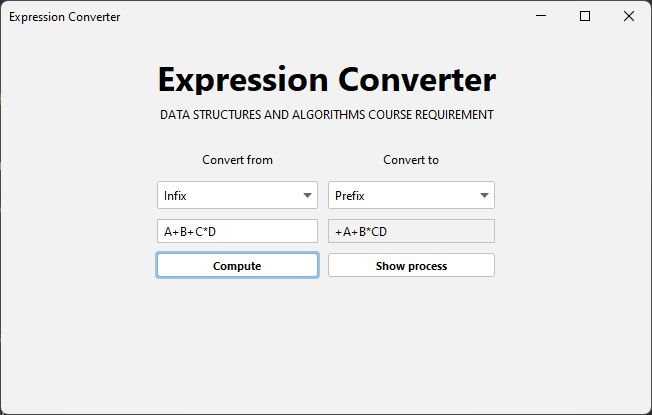
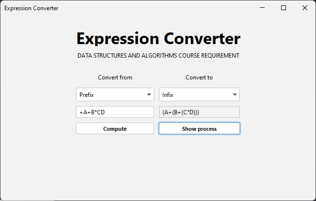
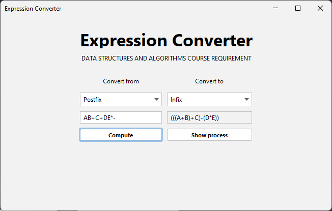
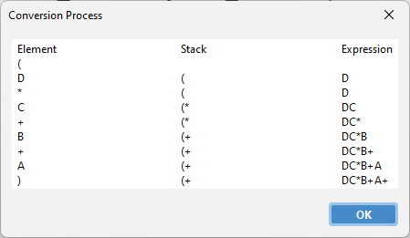

# Expression Converter
A java application made with java swing designed  to provide a user-friendly interface for converting expressions between infix, prefix, and postfix notations.

## User Interface

## Pseudocode
**Infix to Postfix**
1. Initialize a stack and a string variable named concludingExpression to store the converted prefix expression.
2. Append opening and closing brackets to the input infix expression and convert it into an array of string elements.
3. Loop through each element of the expression array using a for loop.
4. Check whether the current element is an operand or an operator or a bracket using boolean variables elementIsOperand, elementIsOperator, and elementIsBracket, respectively.
5. If the current element is an operand, append it to the concludingExpression string.
6. If the current element is an opening bracket, push it onto the stack.
7. If the current element is a closing bracket, pop elements from the stack and append them to the concludingExpression string until an opening bracket is encountered. Discard the opening bracket.
8. If the current element is an operator, compare its precedence with the top element of the stack, which is also an operator. Depending on the result, either push the current operator onto the stack or pop operators from the stack and append them to the concludingExpression string until an operator with lower precedence or an opening bracket is encountered.
9. After processing each element of the expression array, return the concludingExpression string as the converted prefix expression.

**Infix to Prefix**
1. Reverse the given expression and use it as the argument for converting to postfix method.
2. Convert the reversed infix expression to postfix which has the pseudocode above and return output expression.
3. Reverse the output expression.

**Postfix to Infix**
1. Set the input expression as the base expression.
2. Convert the base expression into an array of string elements.
3. Initialize an empty string variable for the concluding expression.
4. Initialize the conversion process log as "Element\t\t Stack".
5. Loop through the string array of the expression from left to right:
   * a. Check if the current element is an operand.
     * i. If it is, push it onto the stack.
     * ii. If it is not, proceed to step b.
   * b. Check if the current element is an operator.
     * i. If it is, pop the top two operands from the stack, and add the current operator between them.
     * ii. Enclose the resulting expression in opening and closing brackets.
     * iii. Push the resulting expression onto the stack.
6. Add the current element and the current state of the stack to the conversion process log.
7. Once the loop is complete, the stack will have only one expression, which is the infix expression.
8. Convert the stack to a string, and set it as the concluding expression.
9. If any exception occurs, set the concluding expression as an empty space.
10. Return the concluding expression.

**Prefix to Infix**
1. Reverse the given expression and use it as the argument for converting to postfix to infix method.
2. Convert the reversed postfix expression to infix which has the pseudocode above and return output expression.
3. Reverse the output expression.

